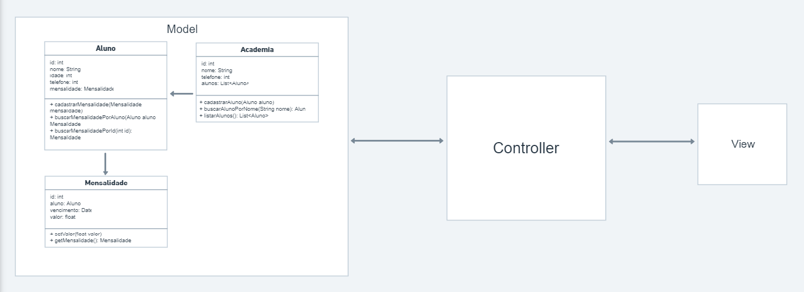

<h1 style="color: #BD93F9;">Engenharia de Software - Prof. Giuliano</h1>

<h2 style="color: #46FA7B">15/08/2022</h2>

"We see three critical differences between programming and software engineering: time, scale, and the trade-offs at play. On a software engineering project, engineers need to be more concerned with the passage of time and the eventual need for change. In a software engineering organization, we need to be more concerned about scale and efficiency, both for the software we produce as well as for the organization that is producing it. Finally, as software engineers, we are asked to make more complex decisions with higher-stakes outcomes, often based on imprecise estimates of time and growth. Within Google, we sometimes say, “Software engineering is programming integrated over time.” Programming is certainly a significant part of software engineering: after all, programming is how you generate new software in the first place. If you accept this distinction, it also becomes clear that we might need to delineate between programming tasks (development) and software engineering tasks (development, modification, maintenance). The addition of time adds an important new dimension to programming. Cubes aren’t squares, distance isn’t velocity. Software engineering isn’t programming."

Titus Winters, Software Engineering at Google

 

<b>R:</b> Podemos notar algumas diferenças entre desenvolvimento e engenharia de software: tempo, escala e trade-offs.
Em projetos de engenharia de software, os engenheiros precisam prestar muita atenção ao fluxo do tempo e às necessidades de mudança, performance, escalabilidade de um sistema, padrões de organização, etc.
Nas organizações de engenharia de software, precisamos nos concentrar mais em escala e eficiência, tanto para o software que produzimos quanto para as organizações que o produzem.
A programação é, com certeza, uma parte de grande importância da engenharia de software: uma vez que é por meio dela que construímos um novo software.
Dessa forma, fica claro que podemos precisar distinguir as atividades de programação (desenvolvimento) e atividades de engenharia de software (desenvolvimento, modificação, manutenção).

 

#

<h2 style="color: #46FA7B">22/08/2022</h2>
 

Projeto

WktFull

### Sistema para gerenciamento de alunos e mensalidade de uma academia.

 

Requisitos

Funcionais: 

- O atendente deve ser capaz de registrar um aluno

- O atendente deve ser capaz de registrar a mensalidade de um aluno

- O atendente deve ser capaz de consultar a mensalidade de um aluno

- O atendente deve ser capaz de consultar um aluno por nome

 

Não funcionais: 

- O sistema deve rodar de forma responsiva em navegadores web

- O sistema deve ser performático e de fácil acesso

- O sistema deve ser feito em ReactJS

 

Diagrama de classe

